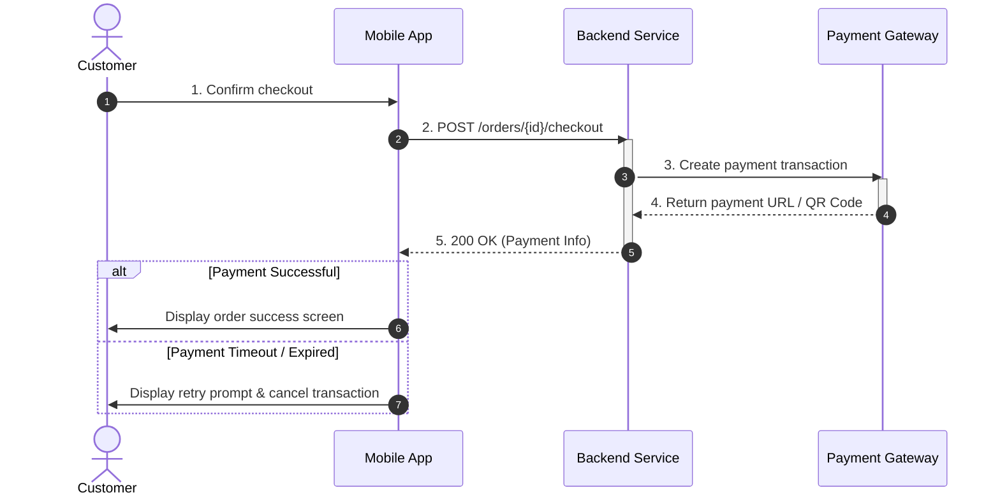
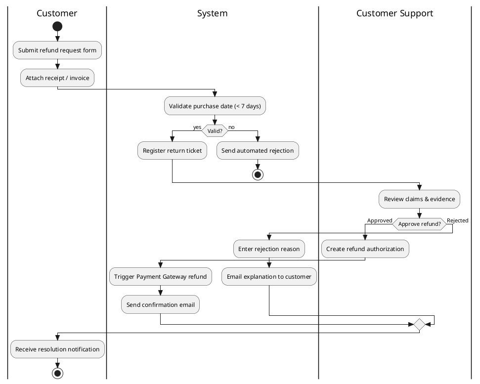
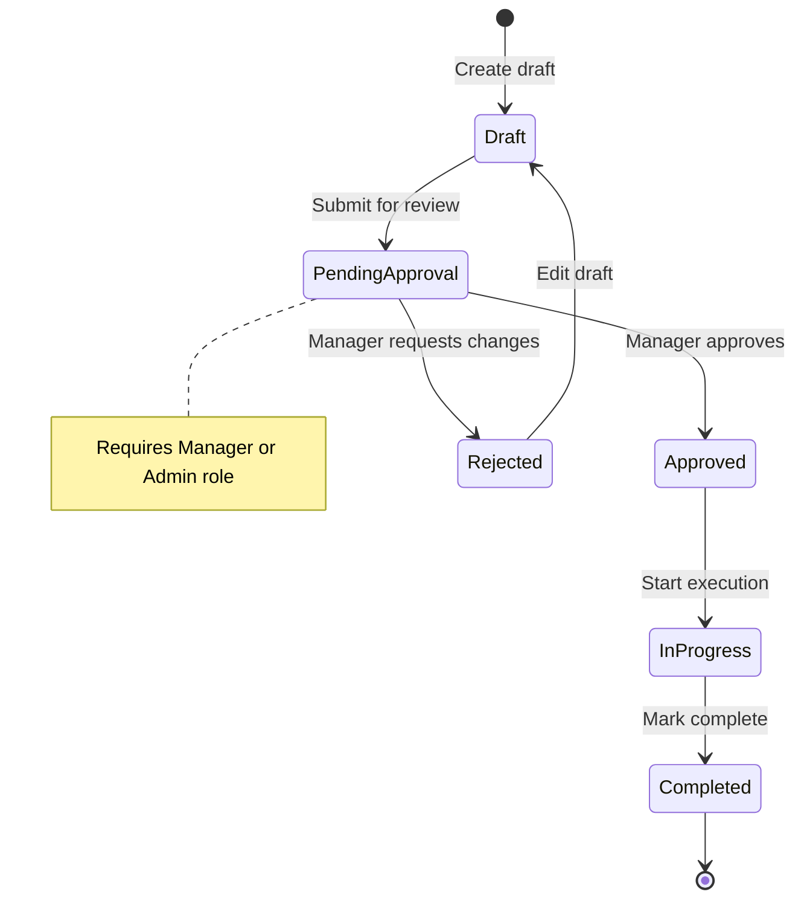
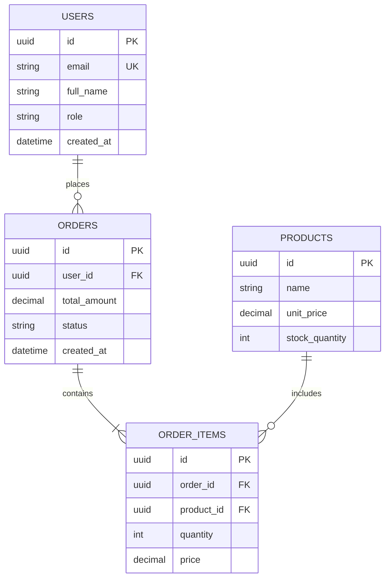

# BA Diagrams Toolkit — System & Business Workflow Modeling

Comprehensive guide for **Business Analysts (BA)**, **Product Managers**, and **System Architects** to select the right diagram type, generate valid syntax (Mermaid, PlantUML, BPMN XML, D2, DBML), perform coverage self-reviews, and export deliverables according to project standards.

---

## 1. Decision Matrix (Diagram Selection)

| Business Scenario | Recommended Diagram | Notation / Engine | Standard Output Location | Key Rationale |
|---|---|---|---|---|
| **Multi-actor interaction over time** (Login, Payment, Webhooks, OAuth, API callbacks) | **Sequence Diagram** | Mermaid (`sequenceDiagram`) | `docs/{feature}/srs/{feature}-flows.md` | Chronological message sequence between $\ge 2$ participants; explicit request/response and error paths (`alt`/`opt`). |
| **Multi-role business workflow** (Multi-level approvals, Refunds, Onboarding, Cross-team handoffs) | **Activity Swimlane** ⭐ *(Default for multi-role)* | PlantUML (`|Lane|`) | `docs/{feature}/srs/{feature}-{slug}-swimlane.puml` | Strict vertical column alignment across actors; avoids cross-edge tangles common in other engines. |
| **Simple linear logic / Algorithm flow** (Single-role logic, validations needing inline Markdown preview) | **Activity / Flowchart** | Mermaid (`flowchart TD`) | `docs/{feature}/srs/{feature}-flows.md` | Compact flow without cross-lane complexity; renders natively in GitHub and Obsidian. |
| **Enterprise standard workflows / ISO processes** (Requires import into Camunda, Bizagi, or workflow engines) | **BPMN 2.0** | BPMN 2.0 XML + HTML/SVG Viewer | `docs/{feature}/bpmn/{process}.bpmn` + `_viewer.html` | Standardized notations (Gateways ◇, Events ○, Activities ▭, Swimlanes). |
| **Entity lifecycle & state transitions** (Account: Pending → Active → Locked; Order: Created → Paid → Shipped) | **State Machine** | Mermaid (`stateDiagram-v2`) | `docs/{feature}/srs/{feature}-states.md` | Entities with $\ge 3$ states; forces documentation of triggers, guards, and transition rules. |
| **High-level system boundary & actors** (Kickoff stakeholder alignment, Scope definition) | **Use Case Diagram** | PlantUML (`skinparam`, `package`) | `docs/{feature}/usecases/{feature}-usecase-diagram.puml` | Native boundary, primary/secondary actors, `<include>`, `<extend>`. |
| **Relational data models** (Tables, attributes, and relationships inline in Markdown) | **ER Diagram** | Mermaid (`erDiagram`) | `docs/{feature}/srs/{feature}-erd.md` | Relational tables, Primary/Foreign keys (PK/FK), and cardinality ($1-1, 1-N, N-N$). |
| **Production database schema / Dev handoff** | **Schema DBML** | DBML (`Table`, `Ref`) | `docs/{feature}/dbdiagram/{feature}.dbml` | Supports export to native SQL (`dbml2sql`), enums, indexes, defaults, and dbdiagram.io sync. |
| **Modern system architecture & service mapping** | **Architecture / D2** | D2 syntax (`shape`, `container`) | `docs/{feature}/d2-architect/{slug}.d2` | Layered containers, microservices, cloud components, and clean visual layouts. |

---

## 2. Syntax Guidelines & Examples

### 2.1. Sequence Diagram (Mermaid)
Use for time-ordered interactions across actors, frontend, backend services, and third-party APIs.



**Rules:**
- Always enable `autonumber` for clear step reference during review.
- Distinguish human `actor` from system `participant`.
- Explicitly detail alternative and error paths (`alt` / `else`).

---

### 2.2. Activity Swimlane Diagram (PlantUML)
Primary choice for workflows spanning multiple roles or departments to keep lane boundaries intact.



---

### 2.3. BPMN 2.0
Use for enterprise process engineering compatible with workflow execution engines.
- Save standard `.bpmn` XML.
- Use the built-in SVG/HTML preview generator in `.agents/skills/ba-diagrams/scripts/bpmn/`.

---

### 2.4. State Machine Diagram (Mermaid)
Model entity lifecycle and permitted state transitions.



---

### 2.5. Entity Relationship Diagram (Mermaid)
Model relational schema structures, primary/foreign keys, and cardinalities.



---

## 3. Diagram Quality Self-Review Checklist

Before delivering diagrams, verify against these 6 core quality criteria:

1. **Actor / Participant Completeness**:
   - Are all interacting entities present (Users, Admins, Third-party APIs, DB, Workers)?
2. **Alternative & Error Flows**:
   - Are failure branches represented (invalid credentials, network timeouts, gateway rejections)?
3. **Dead-End Detection**:
   - In Activity and BPMN flows: Does every path reach an explicit end state (`stop` / `end`) or join back to a valid step? No floating nodes.
4. **Decision Gateway Clarity**:
   - Each decision point must have $\ge 2$ outgoing edges with unambiguous labels (`yes/no`, `valid/invalid`).
5. **Message Order Sanity**:
   - In Sequence diagrams: Responses must never precede their corresponding requests.
6. **No Spec Invention**:
   - Ground every step in verified business facts; mark unknown details with `<!-- TBD -->` and raise Open Questions.

---

## 4. Built-in Tools & Scripts

The skill provides automated utilities in `scripts/`:
- **Mermaid Syntax Verification**:
  ```bash
  node .agents/skills/ba-diagrams/scripts/mermaid-verify.mjs --file <file-with-mermaid.md>
  ```
- **PlantUML Encoding & Rendering**:
  ```bash
  python .agents/skills/ba-diagrams/scripts/plantuml_encode.py <file.puml>
  ```
- **Diagram Templates**:
  - `templates/diagram-sequence.md`
  - `templates/diagram-activity.md`
  - `templates/diagram-bpmn.md`
  - `templates/diagram-erd.md`
  - `templates/diagram-state.md`
  - `templates/usecase-index.md`
